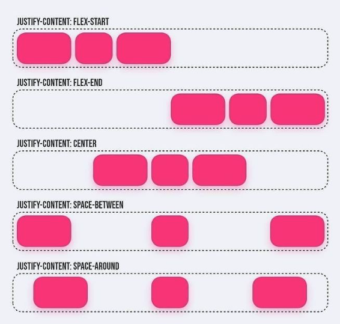
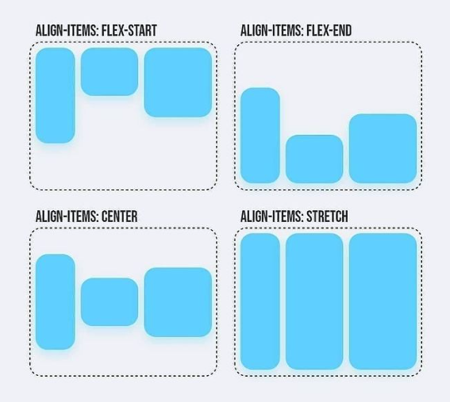
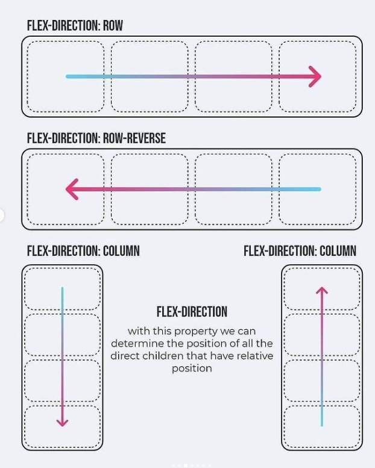
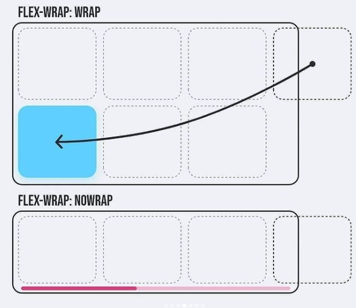
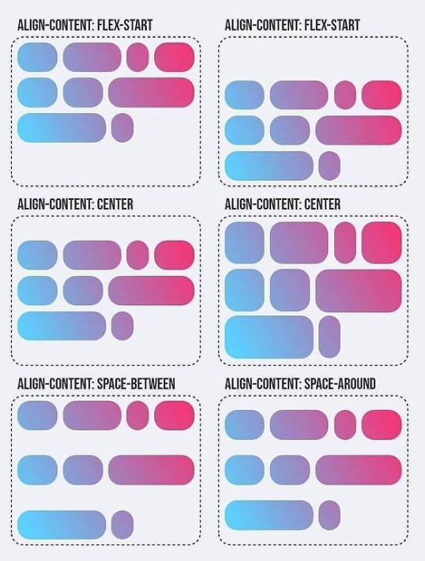

# Flexbox

## justify-content

justify-content aligne les éléments horizontalement et accepte les valeurs suivantes :

- `flex-start` : Les éléments s'alignent au côté gauche du conteneur.
- `flex-end` : Les éléments s'alignent au côté droit du conteneur.
- `center` : Les éléments s'alignent au centre du conteneur.
- `space-between` : Les éléments s'affichent avec un espace égal entre eux.
- `space-around` : Les éléments s'affichent avec un espacement égal à l'entour d'eux.

## align-items

align-items aligne les éléments verticalement et accepte les valeurs suivantes :

- `flex-start` : Les éléments s'alignent au haut du conteneur.
- `flex-end` : Les éléments s'alignent au bas du conteneur.
- `center` : Les éléments s'alignent au centre vertical du conteneur.
- `baseline` : Les éléments s'alignent à la ligne de base du conteneur.
- `stretch` : Les éléments sont étirés pour s'adapter au conteneur.

## flex-direction

flex-direction définit la direction dans laquelle les éléments sont placés dans le conteneur, et accepte les valeurs suivantes :

- `row` : Les éléments sont disposés dans la même direction que le texte.
- `row-reverse` : Les éléments sont disposés dans la direction opposée au texte.
- `column` : Les éléments sont disposés de haut en bas.
- `column-reverse` : Les éléments sont disposés de bas en haut.

> :warning: **Quand la direction est en colonne, justify-content change pour la verticale et align-items pour l'horizontale.**

## flex-wrap

flex-wrap indique si les éléments flexibles sont contraints à être disposés sur une seule ligne ou s'ils peuvent être affichés sur plusieurs lignes avec un retour automatique.

- `nowrap` : Tous les éléments sont tenus sur une seule ligne.
- `wrap` : Les éléments s'enveloppent sur plusieurs lignes au besoin.
- `wrap-reverse` : Les éléments s'enveloppent sur plusieurs lignes dans l'ordre inversé.

## align-content

align-content peut définir comment plusieurs lignes sont espacées de l'une à l'autre. Cette propriété prend les valeurs suivantes :

- `flex-start` : Les lignes sont amassées dans le haut du conteneur.
- `flex-end`: Les lignes sont amassées dans le bas du conteneur.
- `center` : Les lignes sont amassées dans le centre vertical du conteneur.
- `space-between `: Les lignes s'affichent avec un espace égal entre eux.
- `space-around` : Les lignes s'affichent avec un espace égal autour d'eux.
- `stretch` : Les lignes sont étirées pour s'adapter au conteneur.

