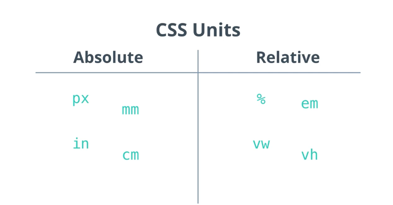

# Introduction

Les CSS (Cascading Style Sheets en anglais, ou « feuilles de style en cascade ») sont le code utilisé pour mettre en forme une page web.

CSS n'est pas vraiment un langage de programmation. C'est un langage de feuille de style, c'est-à-dire qu'il permet d'appliquer des styles sur différents éléments sélectionnés dans un document HTML.

## Selecteurs

```css
* tous les éléments
div toutes les divs
div,p toutes les divs et paragraphes
div p les paragraphes à l'interieur des div
div > p toutes les balises p dont le premier
div + p balises p immédiatement après la div
div ~ p balises p précédé de div
.classname tous les éléments avec une class
#idname élément avec un id
div.classname div avec une certaine class
div#idname div avec un certain id
#idname *tous les éléments à l'interieur de #idname
```

C'est pour cette raison que l'architecture de CSS est principalement basée sur un modèle de boîtes. Chacun de ces blocs prend un certain espace sur la page, de cette façon :

- `padding`, l'espace autour, proche du contenu
- `border`, la ligne qui est juste autour du padding
- `margin`, l'espace extérieur, autour de l'élément


`text-shadow`, affiche une ombre portée sur le texte à l'intérieur de l'élément

`margin: 0 auto ;` — Ici on a deux valeurs pour la propriété. Lorsqu'on utilise deux valeurs sur une propriété comme margin ou padding, la première valeur est utilisée pour le haut et le bas de l'élément (dans ce cas : 0) et la seconde valeur est utilisée pour les côtés gauche et droit

`padding: 0 20px 20px 20px ;` — ici on a quatre valeurs pour le padding afin de créer un peu d'espace autour du contenu. On n'a donc aucun espace pour le padding en haut du corps de la page, on a 20 pixels à gauche, en bas et à droite. Dans l'ordre, les valeurs correspondent au haut, à la droite, au bas et à la gauche.

## Unités css

CSS a plusieurs unités différentes pour exprimer une longueur.

De nombreuses propriétés CSS prennent des valeurs de "longueur", telles que width, margin, padding, font-size, etc.

La longueur est un nombre suivi d'une unité de longueur, telle que `10px`, `2em`, etc.

Il existe deux types d'unités de longueur : absolue et relative .



### Absolue

Les unités absolues font référence à des unités de mesure fixes. En ce sens que la valeur n'est pas calculée par rapport à une autre dimension.

Elles sont généralement utilisées pour traduire une longueur, par exemple un padding, une hauteur de bloc, la taille des caractères, etc.

Les unités de longueur absolue ne sont pas recommandées pour une utilisation à l'écran, car les tailles d'écran varient énormément. Cependant, ils peuvent être utilisés si le support de sortie est connu.

```css
.box {
  width: 150px;
  height: 150 px;
}
```

Cela signifie que l’élément box aura la même dimension (150 x 150 pixels), **quelle que soit la taille de l’écran.**

### Relative

Les unités relative spécifient une longueur relative à une autre propriété de longueur. Les unités de longueur relative évoluent mieux entre différents supports de rendu.

Les unités relative font varier la taille d’un élément en fonction de la taille de la police ou de l’élément parent.

Ces unités dites relatives au texte sont de plus en plus utilisées pour harmoniser les éléments d’un design. On retrouve :

- Em : elle est proportionnelle à la taille de la police de l’élément parent ou du document. Par défaut, 1 em = 16 px si aucune taille de police n’est définie.
- Rem : l’unité rem fait toujours référence à la taille de la police de l’élément racine. En d’autres termes, elle dépend du font-size définit par défaut.

#### Les unités vh et vw

Les unités vh et vw sont similaires, à la seule différence qu’elles dépendent respectivement de la hauteur et de la largeur de la fenêtre de navigation.

Retenez que 1 vh = 1 % de la hauteur du viewport et que 1 vw = 1 % de la largeur du viewport.

L’unité de mesure vh est généralement utilisée pour permettre à un élément de s’adapter à la hauteur totale de la fenêtre :

```css
.box {
  height: 100vh;
  background: red;
}
```

Dans cet exemple ci-dessus, l’élément box a une hauteur de 100 % par rapport à la hauteur de la fenêtre de navigation.

Prenons un autre exemple :

```css
h1 {
  font-size: 6 vw;
}
```

Ici la taille du titre H1 correspond à 6% de la largeur de la fenêtre. Par conséquent, si cette dernière est de 1000 px, la taille de la police sera de 60 px.
