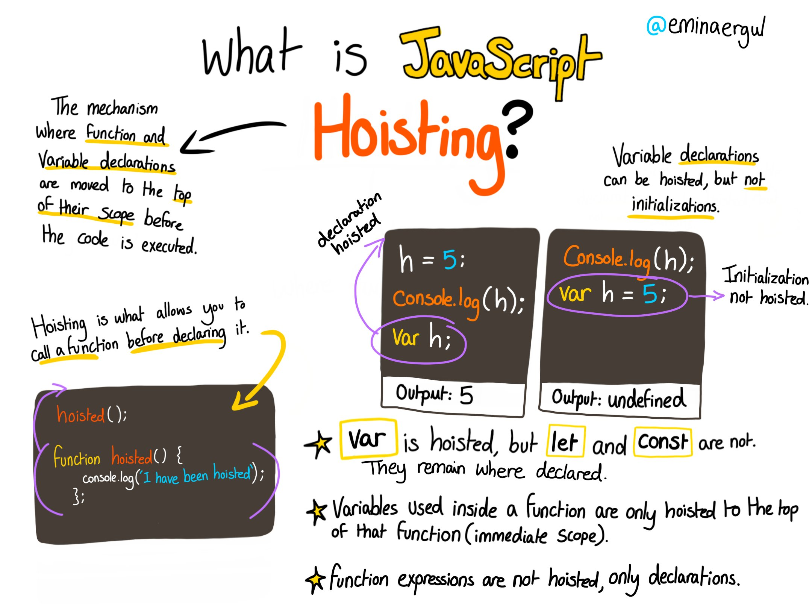

# Let, Const et Var

## Le hoisting

Le hoisting est le comportement par défaut de JavaScript pour hisser les déclarations vers le haut.



Une variable peut être utilisée avant d'avoir été déclarée.

```javascript
x = 5;

elem = document.getElementById("demo");
elem.innerHTML = x;

var x;
```

Les variables déclarées avec let et const éliminent ce problème spécifique de hoisting car elles sont limitées au bloc , pas à la fonction. Auparavant, lorsque vous utilisiez var, les variables étaient étendues globalement ou localement à une étendue de fonction entière.

- Les variables déclarées avec let peuvent être réaffectées, mais ne peuvent pas être redéclarées dans la même portée.
- Les variables déclarées avec const doivent se voir attribuer une valeur initiale, mais ne peuvent pas être redéclarées dans la même portée et ne peuvent pas être réaffectées.

Les variables définies avec let et const sont hissées en haut du bloc, mais pas initialisées .

L'utilisation de let avant qu'il ne soit déclaré entraînera un ReferenceError.

```javascript
// ReferenceError
userName = "jolebowski";
let userName;
```

L'utilisation du const avant qu'il ne soit déclarée est une erreur de syntaxe, donc le code ne s'exécutera tout simplement pas.

```javascript
// ReferenceError
userName = "jolebowski";
const userName;
```

## Let

Un mot-clé appelé let a été introduit dans ES6 (2015), une mise à jour majeure de JavaScript, pour résoudre ce problème potentiel avec le mot-clé var.

Si vous remplacez var par let dans le code ci-dessus, cela génère une erreur :

```javascript
let userName = "Jordan";
let userName = "jolebowski";
SyntaxError : unknown :  'userName' a déjà été déclaré.
```

Ainsi, contrairement à var, lorsque vous utilisez let, une variable portant le même nom ne peut être déclarée qu'une seule fois.

### Block scope

Avant ES6, JavaScript n'avait que Global Scope et Function Scope .
let et const fournissent Block Scope en JavaScript.
Les variables déclarées à l'intérieur d'un bloc { } ne sont pas accessibles depuis l'extérieur du bloc :

```javascript
{
  let x = 2;
}
console.log(x); // x can't be used here
```

Les variables déclarées avec le mot- varclé ne peuvent PAS avoir une portée de bloc.

Les variables déclarées à l'intérieur d'un bloc { } sont accessibles depuis l'extérieur du bloc.

```javascript
{
  var x = 2;
}
// x can be used here
```

## Const

Le mot-clé const a été introduit dans ES6 (2015) .

Les variables définies avec constne peuvent pas être redéclarées.

const a toutes les fonctionnalités impressionnantes que let ont, avec le bonus supplémentaire que les variables déclarées en utilisant const sont en lecture seule. Il s'agit d'une valeur constante, ce qui signifie qu'une fois qu'une variable est affectée avec const, elle ne peut pas être réaffectée :

```javascript
const FAV_PET = "Cats";
FAV_PET = "Dogs";
//Uncaught TypeError: Assignment to constant variable.
```

Remarque : Il est courant que les développeurs utilisent des identifiants des variables en majuscules pour les valeurs immuables et des minuscules ou camelCase pour les valeurs modifiables (objets et tableaux).

Il est important de comprendre que les objets (y compris les tableaux et les fonctions) affectés à une variable à l'aide const sont toujours modifiables. L'utilisation de la const déclaration empêche uniquement la réaffectation de l'identificateur de variable.

```javascript
const s = [5, 6, 7];
s = [1, 2, 3]; // error
s[2] = 45;
console.log(s); // [5, 6, 45];
```

## Quand utilisé let et const ?

let est à utiliser lorsque vous envisagez de réaffecter de nouvelles valeurs à une variable.

const est à utiliser const lorsque vous ne prévoyez pas de réaffecter de nouvelles valeurs à une variable.

Étant donné que const c'est la manière la plus stricte de déclarer une variable, nous vous suggérons de toujours déclarer les variables avec const car cela rendra votre code plus facile à raisonner puisque vous savez que les identifiants ne changeront pas tout au long de la durée de vie de votre programme. Si vous constatez que vous devez mettre à jour une variable ou la modifier, revenez en arrière et passez-la de const à let.
