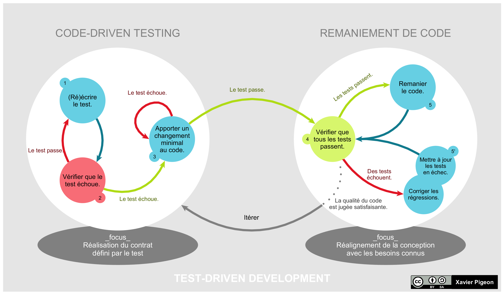

# TDD(test driven developpement)

Le TDD c’est une discipline

est un guide qui permet de te guider vers quelque chose qui fonctionnera
est une méthode de développement de logiciel qui consiste à concevoir un logiciel par petites étapes, de façon progressive, en écrivant avant chaque partie du code source propre au logiciel les tests correspondants et en remaniant le code continuellement.

Avancer avec des feedbacks à l’instant t

