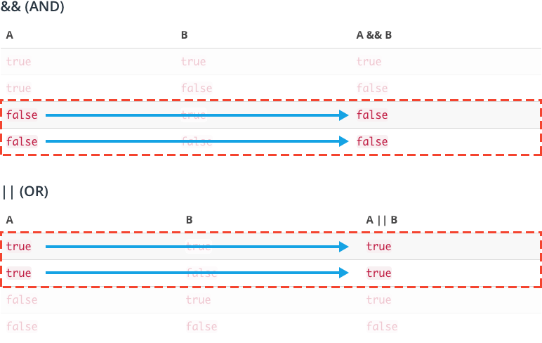

Les opérateurs de comparaison comparent la valeur de gauche avec la valeur de droite.

```js
10 < 12;
```

Il peut être utile de considérer les énoncés de comparaison comme des questions. Lorsque la réponse est "oui", l'énoncé est évalué à `true`, et lorsque la réponse est "non", l'énoncé est évalué à `false`. Le code ci-dessus demanderait : est-ce que 10 est inférieur à 12 ? Oui ! Donc `10 < 12` s'évalue à `true`.

## Opérateur d’égalité, d’égalité stricte, d’inégalité, d’inégalité stricte

Type Coercion est le fait de convertir un type à un autre.

`L’opérateur d’égalité` compare deux valeurs et renvoie true si elle sont équivalentes ou false si elle ne le sont pas

```js
1 == "1"; // true
true == 1; // true
4.0 == 4; // true
```

`L’opérateur d’égalité stricte` n’effectue pas de conversion de type

```js
1 === 1; // true
1 === "1"; // false
4.0 === 4; // true
true === 1; // false
4.0 === 4.1; // false
```

`L’opérateur d’inégalité` est l’opposé de l’opérateur d’égalité

Cela signifie pas égal et revient false là ou l’égalité reviendrait true et vice versa.
Comme l'opérateur d’égalité l’ opérateur d’inégalité convertira les types de données des valeurs lors de la comparaison

```js
a != b; // true
```

`L’opérateur d’inégalité stricte` est l’opposé de l’opérateur d’égalité stricte

Cela signifie pas égal et revient false là ou l’égalité reviendrait true et vice versa.
Renvoie true si les opérandes ne sont pas égaux ou s’ils ne sont pas de même type.

```js
1 !== ‘1’ // true
1 !== 1 // false
```

## Opérateur supérieur , supérieur ou égal à, inférieur

`>` si le nombre à gauche est supérieur au nombre à droite, il renvoie true sinon false.
Comme l'opérateur d'égalité, l'opérateur inférieur convertit les types de données lors de la comparaison

```js
4 > 2; //true
2 > "1"; //true
```

`>=` si le nombre à gauche est supérieur ou égal au nombre à droite il renvoie true sinon false.
Comme l'opérateur d'égalité, l'opérateur inférieur convertit les types de données lors de la comparaison

```js
4 >= 2; //true
10 >= 10; //true
"10" >= 5; // true
```

`<` si le nombre à gauche est inférieur au nombre de droite, il renvoie true sinon false
Comme l'opérateur d'égalité, l'opérateur inférieur convertit les types de données lors de la comparaison

```js
2 < 5; //true
5 < 10; // true
"20" < 10; // false
```

`<=` si le nombre de gauche est inférieur ou égal au nombre à droite , il renvoie true sinon si le nombre de gauche est supérieur au nombre de droite il renvoie false

```js
4 <= 5; // true
7 <= "7"; // true
```

## Opérateur logique &&, ||, !

`&&` renvoie true si et seulement si les opérations à gauche et à droite sont vrais et renvoie false lorsqu’ils ne le sont pas

```js
function isTrue() {
  if (10 <= 20 && 20 >= 10) {
    return true;
  }
}
console.log(isTrue); // true
//10 <= 20 est évaluée en premier, ce qui renvoie true donc il passe à l’évaluation de l’expression à droite (20 >= 10). Cette expression est également évaluée a true */
```

`||` renvoie true si l’un des opérandes est true, sinon false

```js
function test() {
  let num = 5;

  if (num > 10 || num < 5) {
    return "no";
  }
  return "yes";
}
console.log(test()); // "yes"

//num > 10 est évalué en premier, ce qui renvoie false. Comme cette valeur n’est pas véridique, elle renvoie immédiatement l’expression à droite (num < 5) qui est false
```

Voici toutes les possibilités :

```js
true && true = true
false && true = false
true && false = false
false && false = false

true || true = true
true || false = true
false || true = true
false || false = false
```

## Court-circuit

`&&` et `||` évalue de gauche à droite et court-circuit. Cela signifie que dans les deux cas, si le premier opérande satisfait la condition de l’opérateur logique (&&: false ou ||: true), la première expression sera renvoyée, sans même regarder le deuxième opérande à droite.

Dans les deux tableaux ci-dessous, il existe des scénarios spécifiques où, quelle que soit la valeur de B, la valeur de A est suffisante pour satisfaire la condition.
Par exemple, si vous regardez `A && B`, si `A` est false , alors quelle que soit la valeur `B`, l'expression totale sera toujours évaluée à false car les deux `A` et `B` doivent être true dans l'ordre pour que l'expression entière soit true.



Les expression de logiques sont évalués de gauche à droite. Semblables aux expressions mathématiques, les expressions logiques peuvent également utiliser des parenthèses pour indiquer les parties de l’expression qui doivent être évalués en premier.

## Opérateur ténaire

```js
let isNightTime = true;
isNightTime
  ? console.log("Turn on the lights!")
  : console.log("Turn off the lights!");
```

Dans l'exemple ci-dessus :

- La condition, `isNightTime`, est fournie avant le`?`.
- Deux expressions suivent le `?` et sont séparées par deux points `:`.
- Si la condition est évaluée à `true`, la première expression s'exécute.
- Si la condition est évaluée à `false`, la deuxième expression s'exécute

## Nullish Coalescing Operator

L'opérateur `??` renvoie le premier argument s'il est `nul` ou `undefined`. Sinon, il renvoie le second.

```js
let name = null;
let text = "missing";
let result = name ?? text;
console.log(`The name is ${result}`); // the name is missing
```
