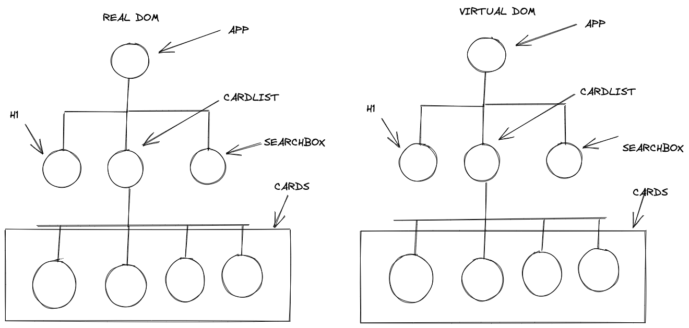

# Le DOM et le virtuel DOM

## Dom (Document Object Model)

Il s'agit d'une représentation structurée des éléments HTML présents dans une page Web ou une application Web. DOM représente l'intégralité de l'interface utilisateur de votre application. 

Le DOM est représenté sous la forme d'une structure de données arborescente. Il contient un nœud pour chaque élément d'interface utilisateur présent dans le document Web. Il est très utile car il permet aux développeurs Web de modifier le contenu via JavaScript. De plus, son format structuré aide beaucoup car nous pouvons choisir des cibles spécifiques et tout le code devient beaucoup plus facile à utiliser. 

Pour pourvoir manipuler le dom avec du Javascript l'api Dom a été conçu pour cela en effet l’utilisation de innerHTML vient de là ou getElementByID.

L’api nous a permis de parcourir le DOM à n’importe quel noeud que nous voulions peut être les supprimer , les ajouter etc.

```javascript
document.getElementById('myDiv').innerValue = 'jolebowski'
```

## Virtual DOM

 React utilise le DOM virtuel qui est comme une copie allégée du DOM réel (une représentation virtuelle du DOM). Ainsi, pour chaque objet qui existe dans le DOM d'origine, il existe un objet pour cela dans React Virtual DOM. 

 Ainsi, chaque fois qu'il y a un changement dans l'état de notre application, le DOM virtuel est mis à jour en premier au lieu du vrai DOM.

 
