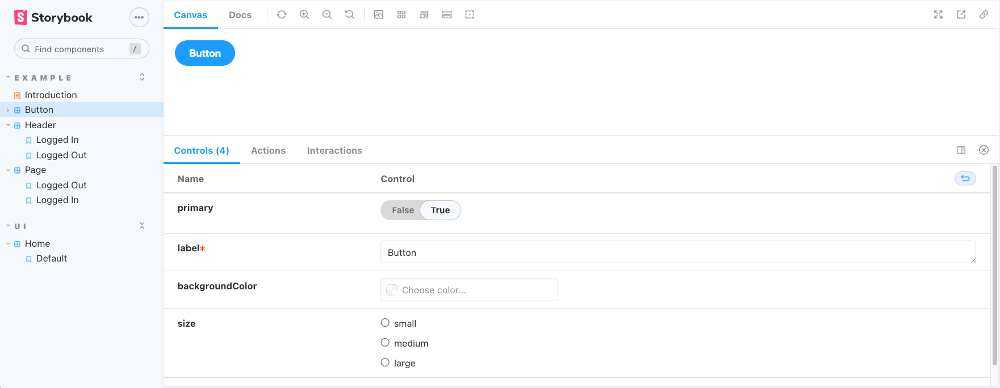

[Storybook](https://storybook.js.org/docs/react/get-started/introduction) est une sorte de documentation pour les composants.

Cela va permettre aux devéloppeurs d'extraire des composants dans un bac à sable ou ils peuvent être explorés et testé sans distractions. Mais aussi de partager le travail avec d'autres développeurs ou client qui peuvent valider que les choses fonctionnent correctement.

Pour installer storybook dans un projet front existant il suffit d'effectuer cette commande :

```
npx storybook init
```

En effet qu'importe le framework front utilisé storybook saura s'adapter.

Une story est une sorte de scénario et idéalement vous allez avoir une story par composant. Ce que nous permet de faire le storybook c'est de tester l'effet de ses propriétés sur le composant.



Les controls présents dans le site de storybook une fois lancé correspond globalement aux propriétés que va recevoir le composant.
La norme voudrait qu'on crée le fichier story (ex : nameComponent.stories.jsx) à coté du composant concerné.
