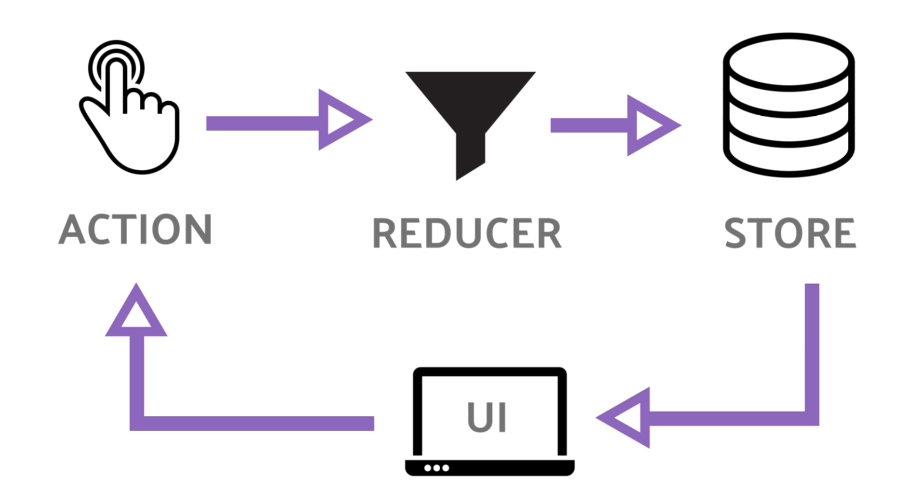
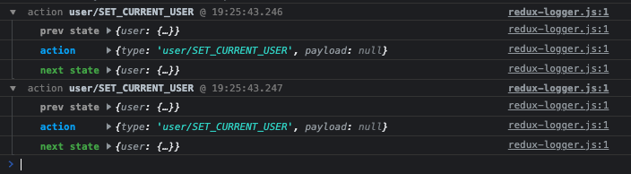

# Redux

Redux est une bibliothèque de gestion d'état utilisée dans les applications JavaScript. Il gère simplement l'état de votre application ou en d'autres termes, il sert à gérer les données de l'application.

Redux permet de gérer l'état de votre application en un seul endroit et de rendre les modifications apportées à votre application plus prévisibles et traçables. Cela facilite le raisonnement sur les changements qui se produisent dans votre application.

Il facilite la gestion de l'état et des données. Au fur et à mesure que la complexité de notre application augmente. Au début, c'est difficile à comprendre mais cela aide vraiment à construire des applications complexes. Au début, cela ressemble à beaucoup de travail, mais c'est vraiment utile

Avant de plonger dans Redux, nous devons connaître certains principes importants de redux. Il y a trois principes de Redux :

- l'état de l'application est stocké dans une arborescence d'objets appelée store .
- cela signifie que nous ne modifions pas directement l'objet d'état et ses propriétés. Au lieu de cela, créez un nouvel objet, recalculez le nouvel état de l'application et mettez-le à jour avec notre objet nouvellement créé. Et c'est important car tous les changements se produisent au même endroit, donc tout doit être fait dans un ordre strict et un par un.
- les reducers sont des fonctions pures qui prennent l'état et l'action précédents (à discuter plus tard) et renvoient le nouvel état.



## Actions

Les actions sont un objet JavaScript simple qui contient des informations. Ils sont la seule source d'information pour le store.

Les actions ont un champ de type qui indique le type d'action à effectuer et tous les autres champs contiennent des informations ou des données.

Tous les reducers réagissent à chaque action.

```js
const addTask = (task) => {
  return {
    type: "ADD_TODO",
    task: task,
  };
};

const removeTask = (task) => {
  return {
    type: "REMOVE_TODO",
    task: task,
  };
};
```

## Reducers

Les réducteurs sont `des fonctions pures` qui prennent l'état et l'action actuels et renvoient le nouvel état et indiquent au magasin comment faire.

Par défault vous devez passer la valeur du state initial en paramètre dans votre fonction ce qui permettra de définir le premier état.

Par défaut vous devez retourner l'état actuel si vous ne répondez à une action.

```js
const INITIAL_STATE = [];
const tasks = (tasks = INITIAL_STATE, action) => {
  const { type } = action;
  switch (type) {
    case "ADD_TODO":
      [...tasks, task];
      break;
    case "REMOVE_TODO":
      tasks.filter((task) => task !== task.id);
      break;
    default:
      tasks;
      break;
  }
};
```

Ainsi, dans le réducteur ci-dessus, une fonction créée avec deux arguments est d'abord l'état actuel et ensuite l'action que nous voulons effectuer, initialisons d'abord le tableau vide de l'état actuel car la première liste de tâches sera vide.
Ensuite, vérifiez le type d'action, différents types d'actions auront des fonctionnalités différentes. Dans le cas ci-dessus, si une tâche est ajoutée, il renvoie le tableau contenant l'ancienne liste de tâches et avec une nouvelle ajoutée, mais l'ancien état ne va pas muter l'ancien. déclarez que nous allons en retourner un nouveau, cela doit être gardé à l'esprit. Idem pour supprimer, si aucun des deux ci-dessus, il suffit de renvoyer la liste. Renvoyer le nouvel état, ne jamais muter l'ancien état.

## Store

Le store est l'objet qui contient l'état de l'application.

```js
export const store = createStore(rootReducer);
```

`createStore` prend trois arguments le premier est est vraiment le seul qui soit nécessaire il prend le rootReducer afin de pourvoir générer le store.

Le store est juste dans le but faciliter le mouvement et le passage des actions à travers ces reducers

```js
import logger from "redux-logger";

const middleWares = [logger];

export const store = createStore(rootReducer, undefined, middleWares);
```

Les middlwares s'exécutent avant q'une action n'atteigne le reducer cela signifie que à chaque fois que vous envoyez une action avant que cette action atteigne les reducers elle atteint d'abord le middleware.

```js
const middleWares = [logger];

const composedEnhancers = compose(applyMiddleware(...middleWares));

export const store = createStore(rootReducer, undefined, composedEnhancers);
```

Pour que les middleware fonctionne correctement il faut utiliser `applyMiddleware`
`Compose` est un concept de programmation fonctionnel c'est essentiellement un moyen pour vous de passer plusieurs fonction de gauche à droite

## Redux dans react

Dans un projet react

Vous pouvez installer reduc de cette manière là

```
yarn add redux react-redux redux-logger
```

`redux` permet d'intéragir avec les reducers qui produisent le root reducer qui produit le store.

Ensuite il y 'a `react-redux` qui vous donne tous les liens React pour que vous puissiez dispatcher ces valeurs de stockage de redux.

`redux-logger` est un excellent petit outil qui vous aide à comprendre comment les actions sont lancées et de savoir ce qui se passe avec votre état.



C'est très pratique car à chaque fois qu'une action se déclenche vous voyez quel était l'état précedent ainsi le prochain état de l'ensemble de l'état redux.

Créez un dossier store avec à l'intérieur un fichier store c'est là où va contenir tout votre redux. C'est ici que va contenir tous les redux ainsi que recevoir tous les actions ou les renvoyer dans vos reduceurs pour mettre à jour l'état. Vous auez besoin d'un fichier store car c'est à l'intérieur que vous allez gérer l'objet du store vous utilisez dans votre application `React`.

Un root reducer est la combinaison de tous nos reducers, c'est comme un gros reducer qui va contenir tous les reducer.

```js
import { combineReducers } from "redux";
```

`combineReducers` est une méthode qui nous permet de créer un grand reducer final que vous pouvez utiliser à l'intérieur de votre store.

Pouvoir englober une application React avec redux il faut utiliser `Provider` afin d'utiliser le store.

```js
import { Provider } from "react-redux";
import { store } from "./redux/store";

const App = () => {
  <Provider store={store}>
    <App />
  </Provider>;
};
```

### useDispatch

Avec react-redux vous avez la posiblité d'utiliser de la même manière que les hooks dans react le `useDispatch` qui vous permet d'intérargir avec le store. Il fonctionne de la même manière qu'un [useContext](/docs/react/useContext).

```js
import { useDispatch } from "react-redux";
const dispatch = useDispatch(setCurrentUser(user));
```

Le dispatch envoie des actions au root reducer qui à son tour transmet l'action à chaque fonction du reducer.

### useSelector

## redux-persist
